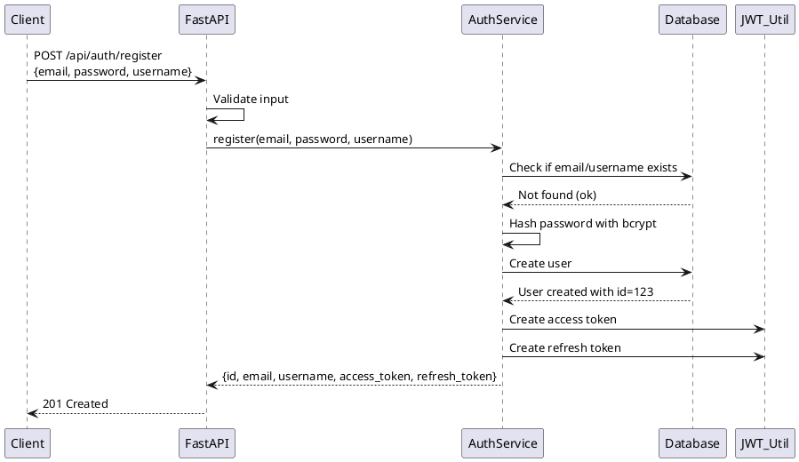
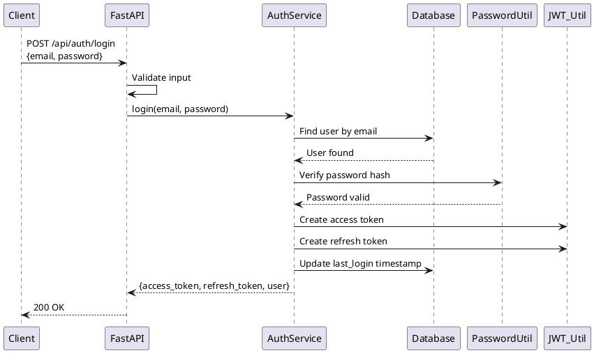
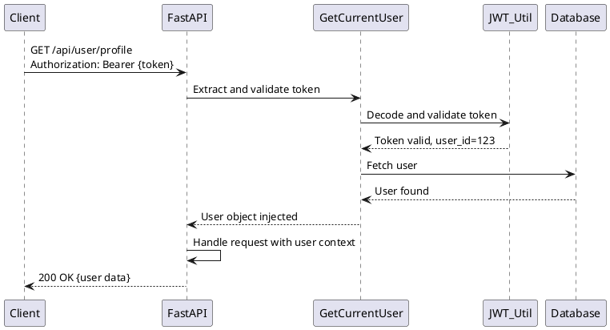

# Auth System Analysis

## Overview

### Objective
Build a production-ready FastAPI authentication system with centralized logging, exception handling, circuit breaker pattern, and comprehensive API documentation via Swagger.

### Tech Stack
- **Backend Framework**: FastAPI (async Python web framework)
- **Language**: Python 3.10+
- **Database**: SQLAlchemy ORM (SQLite for dev, PostgreSQL recommended for production)
- **Authentication**: JWT (JSON Web Tokens) with refresh token mechanism
- **API Documentation**: Swagger/OpenAPI (built-in with FastAPI)
- **Testing**: pytest with async support
- **Logging**: Structured logging with JSON format
- **Error Handling**: Centralized exception handler middleware
- **Resilience**: Circuit breaker pattern for fault tolerance

### Key Entry Points
- `app/main.py`: FastAPI application initialization and middleware setup
- `app/routes/auth.py`: Login and registration endpoints
- `app/services/auth_service.py`: Authentication business logic
- `app/utils/logger.py`: Centralized logging configuration
- `app/middleware/exception.py`: Global exception handler
- `app/utils/circuit_breaker.py`: Circuit breaker implementation

---

## Requirements Breakdown

### 1. FastAPI Application with Auth Endpoints
**Scope**: Create two main endpoints
- **POST /api/auth/register** - User registration
  - Input: `email`, `password`, `username`
  - Output: User object with `id`, `email`, `username`, created at timestamp
  - Validation: Email format, password strength, unique username/email

- **POST /api/auth/login** - User login
  - Input: `email/username`, `password`
  - Output: JWT access token, refresh token, user info
  - Validation: Credentials validation, rate limiting

- **POST /api/auth/refresh** - Token refresh (implicit requirement)
  - Input: Refresh token
  - Output: New access token

- **POST /api/auth/logout** - Logout endpoint (optional, can be client-side only)
  - Input: Access token (in header)
  - Output: Success message (token added to blacklist if needed)

**Protected Routes Pattern**:
- Use `get_current_user()` dependency to protect routes
- Validate JWT token from Authorization header
- Inject user object into route handler

### 2. Centralized Logging System
**Scope**: Implement structured JSON logging

**Requirements**:
- All requests logged with: method, path, status code, response time, request ID
- Business logic logging: user registration, login attempts, errors
- Log levels: DEBUG, INFO, WARNING, ERROR, CRITICAL
- Never log sensitive data (passwords, tokens)
- Include request ID in all log entries for traceability
- Output format: JSON for easy parsing and aggregation

**Implementation Details**:
- Create `app/utils/logger.py` with structured logging setup
- Use `structlog` or Python's `logging` with JSON formatter
- Add request ID middleware (`app/middleware/logging.py`)
- Context-bound logging with request scopes

### 3. Centralized Exception Handling
**Scope**: Global exception handler middleware

**Requirements**:
- Catch all exceptions and return consistent error format
- No stack traces exposed to clients (only in development logs)
- Proper HTTP status codes (400, 401, 403, 404, 500)
- User-friendly error messages with error codes

**Exception Hierarchy**:
```
Exception
├── AuthException
│   ├── InvalidCredentialsException
│   ├── TokenExpiredException
│   └── TokenInvalidException
├── ValidationException
│   ├── DuplicateEmailException
│   ├── DuplicateUsernameException
│   └── WeakPasswordException
├── DatabaseException
│   └── UserNotFoundException
└── CircuitBreakerOpenException
```

**Response Format**:
```json
{
  "detail": "User not found",
  "error_code": "USER_NOT_FOUND",
  "status_code": 404,
  "timestamp": "2026-02-19T10:30:45.123Z",
  "request_id": "abc123-def456"
}
```

**Implementation Details**:
- Create `app/exceptions.py` with custom exception classes
- Create `app/middleware/exception.py` with `ExceptionHandlerMiddleware`
- Register middleware with FastAPI app

### 4. Circuit Breaker Implementation
**Scope**: Fault tolerance pattern for external service calls

**Requirements**:
- Implement three states: Closed (normal), Open (fail fast), Half-Open (recovery test)
- Track failures per service/endpoint
- Configurable thresholds: failure count, timeout duration, half-open attempts
- Exponential backoff for retries
- Metrics: track state transitions

**Use Cases**:
- Database connection failures
- External API calls (if integrated later)
- Email service (for user verification)

**Implementation Details**:
- Create `app/utils/circuit_breaker.py` with `CircuitBreaker` class
- Use decorator pattern: `@circuit_breaker(service="database")`
- Track state changes in logs
- Configuration in `app/config.py`

### 5. Swagger Documentation
**Scope**: Auto-generated API documentation

**Built-in with FastAPI**:
- Available at `/docs` (Swagger UI)
- Available at `/redoc` (ReDoc)
- All endpoints automatically documented with request/response schemas
- Include security scheme for JWT authentication

**Documentation Requirements**:
- All endpoints have clear descriptions
- Request/response examples provided
- Security annotations for protected routes
- Error response documentation

---

## Affected Areas & Database Schema

### Database Tables

#### Users Table
```sql
CREATE TABLE users (
    id INTEGER PRIMARY KEY AUTOINCREMENT,
    username VARCHAR(50) UNIQUE NOT NULL,
    email VARCHAR(100) UNIQUE NOT NULL,
    hashed_password VARCHAR(255) NOT NULL,
    is_active BOOLEAN DEFAULT true,
    created_at TIMESTAMP DEFAULT CURRENT_TIMESTAMP,
    updated_at TIMESTAMP DEFAULT CURRENT_TIMESTAMP,
    last_login TIMESTAMP NULL
);
```

#### Tokens/RefreshTokens Table (optional, for token blacklist/tracking)
```sql
CREATE TABLE refresh_tokens (
    id INTEGER PRIMARY KEY AUTOINCREMENT,
    user_id INTEGER NOT NULL,
    token_hash VARCHAR(255) UNIQUE NOT NULL,
    expires_at TIMESTAMP NOT NULL,
    is_revoked BOOLEAN DEFAULT false,
    created_at TIMESTAMP DEFAULT CURRENT_TIMESTAMP,
    FOREIGN KEY(user_id) REFERENCES users(id) ON DELETE CASCADE
);
```

#### AuditLogs Table (optional, for compliance/debugging)
```sql
CREATE TABLE audit_logs (
    id INTEGER PRIMARY KEY AUTOINCREMENT,
    user_id INTEGER,
    action VARCHAR(50) NOT NULL,
    resource VARCHAR(100) NOT NULL,
    details JSON,
    ip_address VARCHAR(45),
    user_agent TEXT,
    created_at TIMESTAMP DEFAULT CURRENT_TIMESTAMP,
    FOREIGN KEY(user_id) REFERENCES users(id) ON DELETE SET NULL
);
```

### File Structure
```
app/
├── models/user.py              # SQLAlchemy User model
├── schemas/user_schema.py      # Pydantic schemas for API
├── routes/auth.py              # Auth endpoints
├── services/auth_service.py    # Auth business logic
├── utils/jwt.py                # JWT token creation/validation
├── utils/password.py           # Password hashing/verification
└── utils/logger.py             # Logging setup
```

---

## Dependencies & Ripple Effects

### Internal Dependencies
- **Auth routes** depend on: auth_service, jwt_utils, get_current_user dependency
- **Auth service** depends on: User model, password utilities, JWT utilities, database session
- **User service** depends on: User model, database session, validation logic
- **Middleware** (exception, logging) depend on: logger, config
- **Protected routes** depend on: get_current_user dependency

### External Dependencies
- **FastAPI** - web framework (no version lock issues expected)
- **SQLAlchemy** - ORM (compatibility with async drivers needed)
- **Pydantic** - data validation (v2 API changes if upgrading)
- **python-jose** - JWT implementation
- **passlib** - password hashing
- **python-multipart** - for form data parsing (FastAPI dependency)
- **aiosqlite** or **asyncpg** - async database driver

### Middleware Chain Order (Important)
1. Request ID middleware (add unique ID to all requests)
2. Logging middleware (log request details)
3. Exception handler middleware (catch all exceptions)
4. CORS middleware (if cross-origin requests needed)
5. Route handlers

---

## Risks & Edge Cases

### Security Risks
1. **Password Storage**: Ensure passwords hashed with bcrypt (not plaintext)
   - Risk: Plaintext passwords exposed in breach
   - Mitigation: Use passlib with bcrypt algorithm

2. **JWT Token Leakage**: Access tokens could be compromised
   - Risk: Token used by attacker to impersonate user
   - Mitigation: Short expiration (15-30 min), refresh token rotation, HTTPS only

3. **SQL Injection**: User input in queries
   - Risk: Database compromise
   - Mitigation: Use SQLAlchemy ORM with parameterized queries (not raw SQL)

4. **Rate Limiting**: No protection on login endpoint
   - Risk: Brute force attacks
   - Mitigation: Implement rate limiting (e.g., 5 attempts per minute per IP)

5. **CORS**: Open CORS could allow unauthorized access
   - Risk: XSS attacks from other domains
   - Mitigation: Restrict CORS to specific origins

### Data Validation Risks
1. **Email Validation**: Need to validate email format and uniqueness
   - Risk: Invalid data in database, duplicate accounts
   - Mitigation: Use email-validator library, check for duplicates before insert

2. **Password Strength**: Weak passwords
   - Risk: Easy password guessing
   - Mitigation: Enforce minimum length (12 chars), complexity rules

3. **Username Validation**: Prevent reserved names
   - Risk: Conflicts with internal routes
   - Mitigation: Blocklist reserved usernames, alphanumeric validation

### Concurrency Issues
1. **Race Condition on Registration**: Two simultaneous registrations with same email
   - Risk: Duplicate users created
   - Mitigation: Database unique constraint, transaction isolation, catch IntegrityError

2. **Token Refresh Race**: Multiple concurrent refresh attempts
   - Risk: Multiple tokens issued
   - Mitigation: Implement token versioning or refresh token single-use

### Database Issues
1. **Connection Pooling**: Large number of concurrent connections
   - Risk: Database connection limit exhausted
   - Mitigation: Use connection pooling (SQLAlchemy handles this)

2. **Lock Contention**: Heavy concurrent login activity
   - Risk: Database locks, slow response times
   - Mitigation: Optimize queries, use read replicas for user lookup

### Circuit Breaker Issues
1. **False Positives**: Temporary network glitch triggers circuit breaker
   - Risk: Service becomes unavailable during temporary issue
   - Mitigation: Configure reasonable failure thresholds (e.g., 5 failures)

2. **Half-Open Recovery**: Circuit stays open indefinitely if recovery fails
   - Risk: Cascading failure
   - Mitigation: Implement exponential backoff, logging for manual intervention

### Edge Cases
1. **Token Expiration During Request**: Long-running operations with expired token
   - Mitigation: Validate token at start of request, not mid-operation

2. **Timezone Issues**: Created timestamps in different timezones
   - Mitigation: Always use UTC timestamps, convert on client-side

3. **Email Case Sensitivity**: "User@example.com" vs "user@example.com"
   - Mitigation: Normalize email to lowercase before storage/comparison

4. **Concurrent Logout**: User logs out while token still valid
   - Mitigation: Implement token blacklist or revocation list (requires storage)

---

## Database Design Decisions

### Choice: Single Users Table vs Separate Profile Table
- **Decision**: Single `users` table (simplicity over flexibility)
- **Rationale**: MVP doesn't require extensive user attributes; avoids JOIN complexity
- **Future**: Easy to migrate to separate tables if needed

### Choice: JWT vs Session-Based Auth
- **Decision**: JWT tokens (stateless)
- **Rationale**: Stateless scaling, easier for microservices, standard for APIs
- **Tradeoff**: Can't revoke tokens instantly (use blacklist if needed)

### Choice: Refresh Token Storage
- **Decision**: Optional refresh_tokens table for revocation/tracking
- **Rationale**: Provides audit trail, allows immediate logout, prevents token reuse
- **Fallback**: Can be added later without breaking API

### Choice: Database for Auth Service
- **Decision**: SQLite for development, PostgreSQL for production
- **Rationale**: SQLite simplicity for local dev, PostgreSQL robustness for production
- **Async Driver**: Use `aiosqlite` (SQLite) or `asyncpg` (PostgreSQL)

---

## Implementation Recommendations

### Phase 1: Core Auth System (Foundation)
1. Set up FastAPI project structure with dependencies
2. Implement SQLAlchemy User model and database connection
3. Create User and Auth services with business logic
4. Implement JWT utilities (token creation, validation)
5. Create registration and login endpoints
6. Add basic tests

### Phase 2: Observability & Resilience
1. Implement centralized logging (structured JSON format)
2. Add request ID middleware for traceability
3. Implement global exception handler middleware
4. Add circuit breaker for database calls (optional for auth, required for future integrations)
5. Add comprehensive error handling tests

### Phase 3: Documentation & Polish
1. Add Swagger/OpenAPI annotations to all endpoints
2. Create example requests/responses
3. Implement rate limiting on auth endpoints
4. Add audit logging for security events
5. Write integration tests

### Phase 4: Security Hardening (Post-MVP)
1. Implement token blacklist for logout
2. Add CORS configuration
3. Implement password reset flow
4. Add email verification (if required)
5. Implement refresh token rotation

### Phase 5: Optimization
1. Database query optimization (indexes on email, username)
2. Add caching for user lookups (if scale requires)
3. Implement connection pooling tuning
4. Add monitoring/metrics

---

## Testing Strategy

### Unit Tests
- Test auth_service.register() with valid/invalid inputs
- Test auth_service.login() with correct/incorrect credentials
- Test JWT token creation and validation
- Test password hashing and verification
- Test input validation (email, username, password strength)

### Integration Tests
- Test POST /api/auth/register endpoint
- Test POST /api/auth/login endpoint
- Test protected routes with valid/invalid tokens
- Test token refresh flow
- Test concurrent registration attempts (race condition)

### Test Fixtures
- `user_factory`: Create test users
- `valid_token_factory`: Generate valid JWT tokens
- `expired_token_factory`: Generate expired tokens
- `db_session`: Test database with cleanup

### Coverage Goals
- Minimum 80% code coverage
- 100% coverage for auth_service and jwt utilities
- Core exception handling paths covered

---

## Configuration & Environment

### Required Environment Variables
```
DATABASE_URL=sqlite:///./test.db          # Development
JWT_SECRET_KEY=your-secret-key-here       # Min 32 characters
JWT_ALGORITHM=HS256                        # JWT algorithm
ACCESS_TOKEN_EXPIRE_MINUTES=30             # Access token TTL
REFRESH_TOKEN_EXPIRE_DAYS=7                # Refresh token TTL
ENVIRONMENT=development                    # development, testing, production
LOG_LEVEL=INFO                             # Logging level
```

### Optional Configuration
```
DATABASE_MAX_POOL_SIZE=20                  # DB connection pool size
CIRCUIT_BREAKER_THRESHOLD=5                # Failure threshold
CIRCUIT_BREAKER_TIMEOUT=60                 # Open state duration (seconds)
CORS_ORIGINS=["http://localhost:3000"]    # Allowed origins
RATE_LIMIT_ENABLED=true                    # Enable rate limiting
RATE_LIMIT_REQUESTS=5                      # Requests per window
RATE_LIMIT_WINDOW=60                       # Time window (seconds)
```

---

## Key Architectural Patterns

### 1. Dependency Injection
- Use FastAPI's `Depends()` for clean, testable code
- Common dependencies: `get_db()`, `get_current_user()`, `get_logger()`
- Reduces tight coupling, easier mocking in tests

### 2. Service Layer Pattern
- Separate business logic from HTTP layer
- `AuthService` handles registration, login, token validation
- `UserService` handles user operations (lookup, creation, update)
- Enables reuse across different interfaces (API, CLI, webhooks)

### 3. Repository Pattern (Optional)
- Data access abstraction layer
- `UserRepository.find_by_email()`, `.find_by_id()`, `.save()`
- Makes database swaps easier (SQLite → PostgreSQL)

### 4. Circuit Breaker Pattern
- Graceful degradation on external failures
- Three states: Closed (normal) → Open (fail-fast) → Half-Open (recovery)
- Prevents cascading failures in distributed systems

### 5. Middleware Chain
- Composable middleware for cross-cutting concerns
- Order: Request ID → Logging → Exception Handler → CORS → Routes
- Enables separation of concerns

---

## Success Criteria

✅ **Phase: Analysis Complete When**
- [ ] CLAUDE.md written with complete project standards
- [ ] analysis.md completed with all sections
- [ ] Database schema designed and documented
- [ ] API endpoint specifications defined
- [ ] Error handling strategy documented
- [ ] Testing strategy outlined
- [ ] Architectural decisions made and justified

✅ **Phase: Implementation Complete When**
- [ ] All endpoints functional with proper validation
- [ ] Centralized logging working with structured JSON output
- [ ] Exception handler middleware catching and properly formatting errors
- [ ] Circuit breaker implemented and tested
- [ ] Swagger documentation auto-generated and complete
- [ ] Database schema created and migrations working
- [ ] Tests written and passing (80%+ coverage)
- [ ] No sensitive data in logs or error responses

---

## Additional Notes

### Sequence Diagram (PlantUML) - Registration Flow


### Sequence Diagram (PlantUML) - Login Flow


### Sequence Diagram (PlantUML) - Protected Route Access


---

## Deployment Considerations

### Development Environment
- SQLite database (embedded, no setup needed)
- Local JWT secret (for testing)
- DEBUG logging level

### Production Environment
- PostgreSQL database (separate server, managed backups)
- Secure JWT secret (from environment, min 32 characters)
- INFO logging level, sent to centralized log aggregator
- HTTPS enforced
- CORS configured to specific origin
- Rate limiting enabled
- Database connection pooling optimized

### Container Deployment (Docker)
```dockerfile
FROM python:3.11-slim
WORKDIR /app
COPY requirements.txt .
RUN pip install --no-cache-dir -r requirements.txt
COPY app/ .
CMD ["uvicorn", "main:app", "--host", "0.0.0.0", "--port", "8000"]
```

---

## Conclusion

This auth system is designed as a **stateless, scalable, production-ready** foundation that can support:
- ✅ Secure user authentication with JWT
- ✅ Comprehensive logging for debugging and compliance
- ✅ Centralized error handling for consistent API responses
- ✅ Fault tolerance via circuit breaker pattern
- ✅ Auto-generated API documentation via Swagger
- ✅ Easy testing with dependency injection and service layer separation

The architecture supports future extensions:
- Email verification and password reset flows
- Multi-factor authentication (2FA)
- Social login integrations
- OAuth2 delegation for third-party apps
- Role-based access control (RBAC)
- Audit logging and compliance tracking
