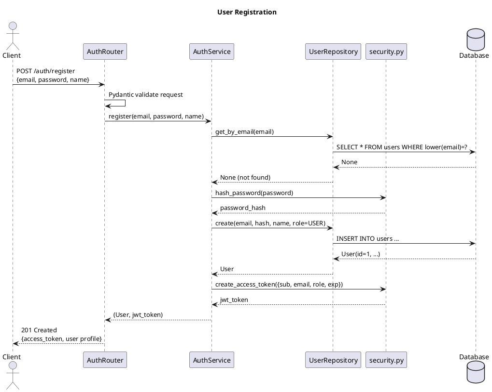
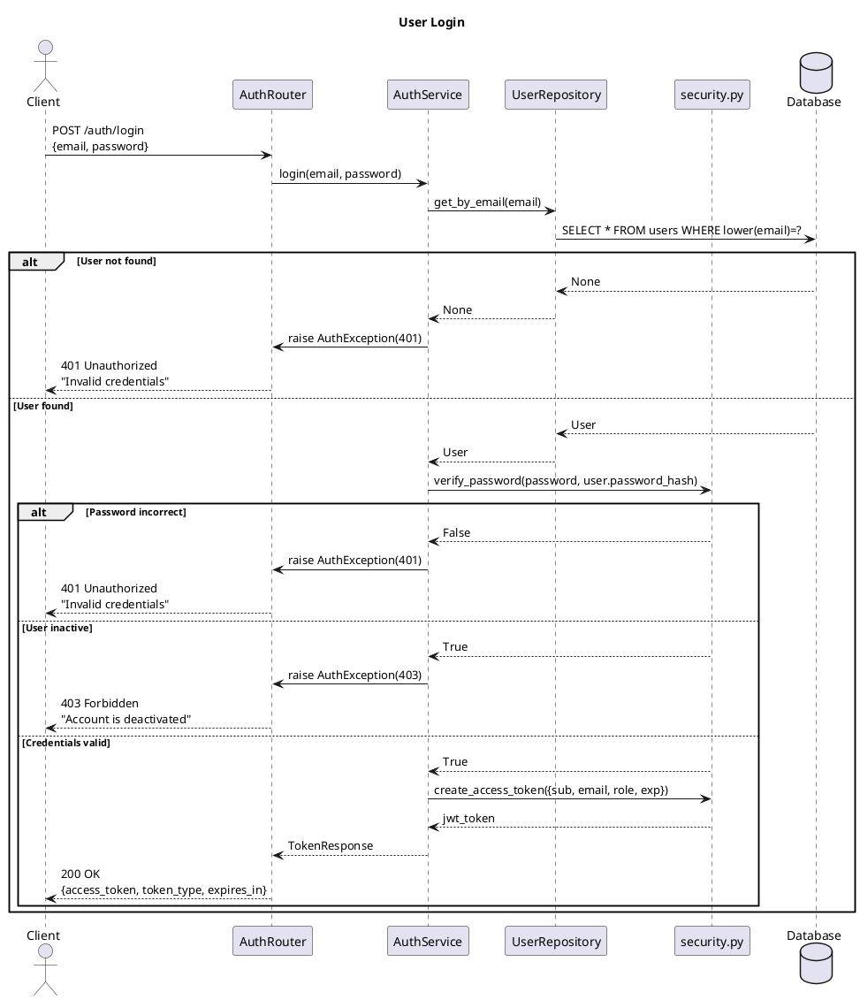
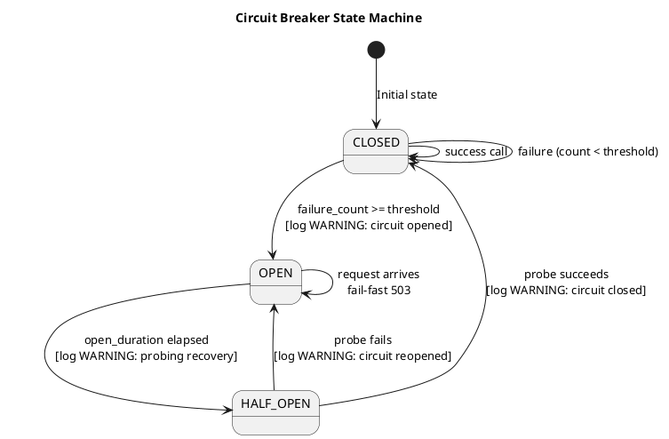
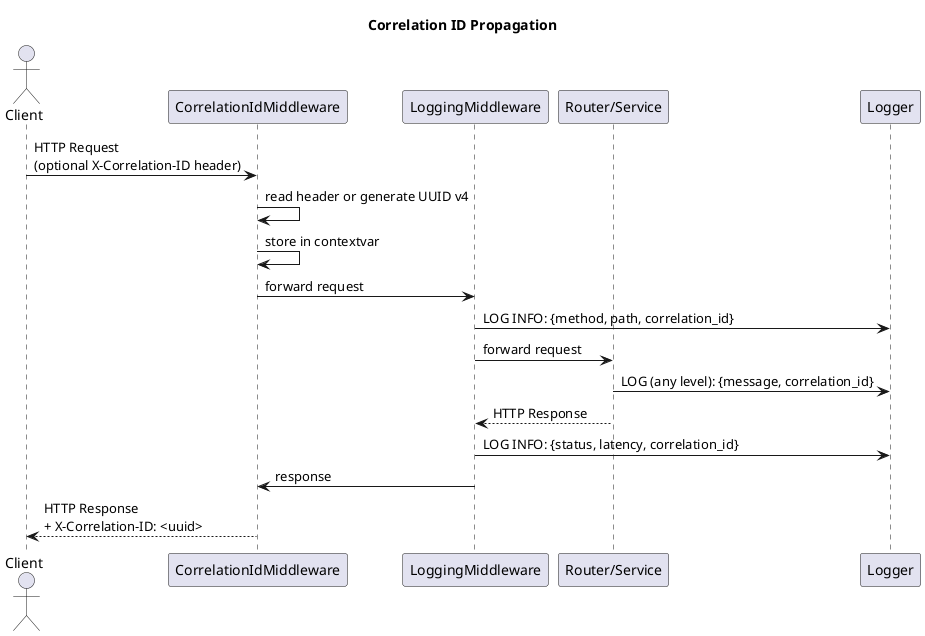

# Architecture: FastAPI Auth & Circuit Breaker App

## Architecture Overview

**Style:** Layered Monolith
**Rationale:** The requirements describe a single deployable service with well-defined functional areas (auth, users, health) and no independent scaling requirements per feature. A layered monolith (Router → Service → Repository → Database) minimizes operational complexity while satisfying all functional and non-functional requirements. The circuit breaker, middleware, and RBAC are cross-cutting concerns that integrate cleanly into a monolith without the overhead of inter-service communication.

### Component Diagram

```
┌────────────────────────────────────────────────────────────────────┐
│                        HTTP Middleware Stack                        │
│  CorrelationIdMiddleware → LoggingMiddleware → CORS Middleware      │
├────────────────────────────────────────────────────────────────────┤
│                          Router Layer                              │
│  ┌──────────────┐  ┌──────────────┐  ┌──────────────────────────┐ │
│  │  AuthRouter  │  │  UsersRouter │  │      HealthRouter         │ │
│  │ /auth/*      │  │  /users/*    │  │  /health/live|ready|cb    │ │
│  └──────┬───────┘  └──────┬───────┘  └────────────┬─────────────┘ │
├─────────┼──────────────────┼──────────────────────┼───────────────┤
│         │             Service Layer                │               │
│  ┌──────┴───────┐  ┌──────┴───────┐               │               │
│  │  AuthService │  │  UserService │               │               │
│  └──────┬───────┘  └──────┬───────┘               │               │
│         │                 │                        │               │
│  ┌──────┴─────────────────┴────┐  ┌───────────────┴─────────────┐ │
│  │         Core Layer          │  │      CircuitBreaker          │ │
│  │  security.py | dependencies │  │  (in-memory, per named dep)  │ │
│  └─────────────────────────────┘  └─────────────────────────────┘ │
├────────────────────────────────────────────────────────────────────┤
│                        Repository Layer                            │
│                    ┌──────────────────────┐                        │
│                    │   UserRepository     │                        │
│                    └──────────┬───────────┘                        │
├───────────────────────────────┼────────────────────────────────────┤
│                               │   Database Layer                   │
│                    ┌──────────┴───────────┐                        │
│                    │  SQLAlchemy Async    │                        │
│                    │  Engine + Session    │                        │
│                    └──────────┬───────────┘                        │
│                    ┌──────────┴───────────┐                        │
│                    │  PostgreSQL (prod)   │                        │
│                    │  SQLite   (dev/test) │                        │
│                    └──────────────────────┘                        │
└────────────────────────────────────────────────────────────────────┘
```

---

## Technology Decisions

| Category | Decision | Rationale |
|----------|----------|-----------|
| Language | Python 3.12 | Matches team ecosystem for FastAPI; async support mature |
| Framework | FastAPI 0.110+ | Async-first, automatic OpenAPI generation, Pydantic v2 |
| Database (prod) | PostgreSQL 16 | ACID, JSON support, robust async driver (asyncpg) |
| Database (dev/test) | SQLite via aiosqlite | Zero-setup local dev and test isolation |
| ORM | SQLAlchemy 2.x (async) | Industry standard, async support, Alembic integration |
| Auth | JWT (python-jose[cryptography]) | Stateless, configurable expiration, HS256 |
| Password Hashing | passlib[bcrypt] | BCrypt with configurable rounds (default 12) |
| Migrations | Alembic | First-class SQLAlchemy integration, version-controlled schema |
| API Docs | FastAPI built-in (swagger-ui) | Auto-generated from Pydantic schemas; zero extra deps |
| Logging | python-json-logger | Lightweight JSON formatting for stdlib logging |
| Circuit Breaker | Custom (in-process) | No external dependency needed; requirements fully custom |
| Build | pip + requirements.txt | Standard Python tooling; easy CI integration |
| Linting | ruff | Fast, modern Python linter |

---

## Component Design

### Middleware Layer
- **Purpose:** Pre/post-process every HTTP request before it reaches route handlers
- **Components:**
  - `CorrelationIdMiddleware` — reads `X-Correlation-ID` from incoming headers or generates UUID v4; stores in context var; appends to response header
  - `LoggingMiddleware` — logs request (method, path, client IP) and response (status, latency) at INFO level; reads correlation_id from context var
- **Dependencies:** None (pure middleware)
- **Public API:** Sets context var `correlation_id` accessible throughout request lifetime

### Router Layer (`app/routers/`)
- **Purpose:** HTTP request handling, input validation via Pydantic, response serialization
- **Components:** `auth.py`, `users.py`, `health.py`
- **Dependencies:** Service layer, Core dependencies
- **Public API:** REST endpoints (`/auth/register`, `/auth/login`, `/users/me`, `/users`, `/health/*`)
- **Rules:** Routers only call services — never repositories directly

### Service Layer (`app/services/`)
- **Purpose:** Business logic, transaction management, orchestration
- **Components:** `auth_service.py`, `user_service.py`
- **Dependencies:** Repository layer, `core/security.py`, `core/circuit_breaker.py`
- **Public API:** Async service methods returning domain objects or raising AppExceptions

### Repository Layer (`app/repositories/`)
- **Purpose:** Async data access, CRUD operations via SQLAlchemy
- **Components:** `user_repository.py`
- **Dependencies:** `database.py` (AsyncSession)
- **Public API:** Async repository methods (get_by_email, get_by_id, create, list_paginated)

### Core Layer (`app/core/`)
- **Purpose:** Cross-cutting utilities used by multiple layers
- **Components:**
  - `security.py` — JWT encode/decode (python-jose), bcrypt hash/verify (passlib)
  - `circuit_breaker.py` — CircuitBreaker class with CLOSED/OPEN/HALF_OPEN state machine
  - `dependencies.py` — FastAPI dependency functions: `get_current_user()`, `require_admin()`
- **Dependencies:** `config.py`, `exceptions.py`
- **Public API:** Importable functions/classes

### Models (`app/models/`)
- **Purpose:** SQLAlchemy ORM entity definitions
- **Components:** `user.py` (User model), `enums.py` (Role, CircuitBreakerStateEnum)
- **Dependencies:** SQLAlchemy DeclarativeBase
- **Public API:** ORM classes used by repository layer

### Schemas (`app/schemas/`)
- **Purpose:** Pydantic v2 DTOs for request validation and response serialization
- **Components:** `auth.py`, `user.py`, `common.py`, `health.py`
- **Dependencies:** Pydantic v2
- **Public API:** Schema classes used in router function signatures

### Config (`app/config.py`)
- **Purpose:** Load all configuration from environment variables with validation
- **Dependencies:** pydantic-settings
- **Public API:** `Settings` singleton, `get_settings()` dependency

### Exception Handling (`app/exceptions.py` + `app/exception_handlers.py`)
- **Purpose:** Consistent error responses across all error scenarios
- **Components:** Custom exception hierarchy + FastAPI exception handlers
- **Dependencies:** `app/schemas/common.py` (ErrorResponse)

---

## Data Flow

### Request Flow (Happy Path)
```
Client
  → CorrelationIdMiddleware (assign/read X-Correlation-ID)
  → LoggingMiddleware (log request start)
  → CORS Middleware
  → Router (Pydantic validation → 422 if invalid)
  → Core/dependencies.py (JWT validation → 401/403 if invalid)
  → Service (business logic, circuit breaker check)
  → Repository (async SQLAlchemy query)
  → Database (PostgreSQL / SQLite)
  ← Repository (ORM model instance)
  ← Service (domain result)
  ← Router (Pydantic response schema serialization)
  → LoggingMiddleware (log response: status + latency)
Client ← HTTP Response (with X-Correlation-ID header)
```

### Error Flow
```
Exception raised in Service/Repository
  → exception_handlers.py (catches AppException subclasses)
  → Logs error + correlation_id + stack trace (for 5xx)
  → Returns ErrorResponse JSON (no stack trace in body)
Client ← Structured JSON error response
```

---

## PlantUML Sequence Diagrams

### User Registration Sequence


### User Login Sequence


### Circuit Breaker State Flow


### Request Correlation ID Flow


---

## Security Architecture

### Authentication
- Method: JWT Bearer tokens (HS256)
- Token lifetime: configurable via `ACCESS_TOKEN_EXPIRE_MINUTES` (default: 60 minutes)
- Token structure: `{ "sub": "<user_id>", "email": "<email>", "role": "USER|ADMIN", "exp": <epoch> }`
- Password hashing: BCrypt via passlib (configurable rounds via `BCRYPT_ROUNDS`, default: 12)
- Secret: `SECRET_KEY` environment variable — no default, app fails at startup if missing

### Authorization — Endpoint Access Matrix

| Endpoint | Public | USER | ADMIN |
|----------|--------|------|-------|
| POST /auth/register | Yes | — | — |
| POST /auth/login | Yes | — | — |
| GET /users/me | — | Yes | Yes |
| GET /users | — | — | Yes |
| GET /health/live | Yes | — | — |
| GET /health/ready | Yes | — | — |
| GET /health/circuit-breakers | Yes | — | — |
| GET /docs | Yes* | — | — |
| GET /redoc | Yes* | — | — |
| GET /openapi.json | Yes* | — | — |

*Docs endpoints disabled in production when `DOCS_ENABLED=false`

### RBAC Implementation
- `get_current_user()` — FastAPI dependency: validates JWT, loads user from DB, raises 401 if invalid
- `require_admin()` — depends on `get_current_user()`, raises 403 if role != ADMIN
- Dependencies injected at router level via `Depends()`

### Input Validation
- All request bodies validated via Pydantic v2 schemas
- Email: validated via `EmailStr` (pydantic[email])
- Password: minimum length 8 enforced via `Field(min_length=8)`
- Pagination: `page >= 1`, `page_size` clamped to `[1, 100]`

### OWASP API Top 10 Mitigations
1. **BOLA** — `GET /users/me` always returns the authenticated user's own record; no user-supplied ID lookup
2. **Broken Auth** — JWT validation on every protected request; bcrypt prevents rainbow table attacks
3. **BOPLA** — Response schemas (UserResponse) never include `password_hash`; explicit field inclusion in schemas
4. **Unrestricted Resources** — Pagination max 100 items; query limits enforced in repository
5. **BFLA** — `require_admin()` enforced at router level for admin endpoints
6. **Sensitive Flows** — Rate limiting noted (gateway-level concern); circuit breaker prevents abuse cascades
7. **SSRF** — No user-supplied URLs used in backend HTTP calls
8. **Security Misconfig** — CORS origins whitelist via `CORS_ORIGINS` env var (no wildcard in prod); docs disabled in prod
9. **Improper Inventory** — All endpoints in OpenAPI schema; `DOCS_ENABLED` flag controls exposure
10. **Unsafe Consumption** — Circuit breaker wraps all external calls; responses validated before use

---

## Observability Strategy

### Logging
- Format: JSON (structured) in production (`APP_ENV=production`), human-readable in development
- Library: `python-json-logger` wrapping stdlib `logging`
- Every log entry includes: `timestamp`, `level`, `logger`, `message`, `correlation_id`
- **Never log:** `password`, `password_hash`, `access_token`, PII fields
- Log levels:
  - `ERROR` — unhandled exceptions, 5xx responses, circuit breaker probe failures
  - `WARNING` — circuit breaker state changes (OPEN, HALF-OPEN, CLOSED)
  - `INFO` — all HTTP requests/responses, startup/shutdown events
  - `DEBUG` — SQL queries (SQLAlchemy echo), detailed service flow

### Correlation IDs
- Generated: UUID v4 per incoming request in `CorrelationIdMiddleware`
- Propagated via: `X-Correlation-ID` request/response header
- Stored in: Python `contextvars.ContextVar` for thread-safe propagation
- Included in: ALL log statements via logging filter that injects from contextvar
- Returned in: `X-Correlation-ID` response header on every response
- Included in: all ErrorResponse JSON bodies as `correlation_id` field

### Health Checks
- **Liveness:** `GET /health/live` → `200 {"status": "ok"}` — always succeeds if process is running
- **Readiness:** `GET /health/ready` → `200 {"status": "ok", ...}` or `503 {"status": "degraded", ...}` — checks DB connectivity and circuit breaker states
- **Circuit Breakers:** `GET /health/circuit-breakers` → returns state of all named circuit breakers

---

## Configuration Strategy (12-Factor App)

| Variable | Description | Required | Default |
|----------|-------------|----------|---------|
| DATABASE_URL | Async DB connection string | No | `sqlite+aiosqlite:///./dev.db` |
| SECRET_KEY | JWT signing secret | **Yes (prod)** | None (startup fails) |
| ACCESS_TOKEN_EXPIRE_MINUTES | JWT lifetime in minutes | No | `60` |
| BCRYPT_ROUNDS | BCrypt work factor | No | `12` |
| CORS_ORIGINS | Comma-separated allowed origins | No | `http://localhost:3000` |
| LOG_LEVEL | Logging level (DEBUG/INFO/WARNING/ERROR) | No | `INFO` |
| APP_ENV | Environment (development/production) | No | `development` |
| DOCS_ENABLED | Enable /docs and /redoc | No | `true` |
| CB_FAILURE_THRESHOLD | Circuit breaker failure threshold | No | `5` |
| CB_OPEN_DURATION_SECONDS | Circuit open duration before HALF-OPEN | No | `30` |
| DB_POOL_SIZE | SQLAlchemy pool size | No | `5` |

- Pydantic `BaseSettings` reads from env vars and `.env` file (for local dev)
- App fails fast at startup if required vars missing (`SECRET_KEY` when `APP_ENV=production`)
- No secrets in source code or committed config files

---

## Database Design

### Entity Relationship Diagram

```
┌─────────────────────────────────────────────┐
│                   users                      │
├─────────────────────────────────────────────┤
│ id           INTEGER  PK AUTO_INCREMENT       │
│ email        VARCHAR(255) UNIQUE NOT NULL     │  ← case-insensitive index
│ password_hash VARCHAR(255) NOT NULL           │
│ name         VARCHAR(100) NOT NULL            │
│ role         ENUM(USER, ADMIN) NOT NULL       │  DEFAULT: USER
│ active       BOOLEAN NOT NULL                 │  DEFAULT: true
│ created_at   DATETIME(UTC) NOT NULL           │  DEFAULT: now()
│ updated_at   DATETIME(UTC) NOT NULL           │  DEFAULT: now(), ON UPDATE now()
└─────────────────────────────────────────────┘

Future Extension:
┌─────────────────────────────────────────────┐
│                 audit_logs                   │
├─────────────────────────────────────────────┤
│ id             INTEGER  PK AUTO_INCREMENT     │
│ user_id        INTEGER  FK → users.id NULL    │
│ action         VARCHAR(100) NOT NULL          │
│ resource       VARCHAR(100) NOT NULL          │
│ detail         JSON NULL                      │
│ correlation_id VARCHAR(36) NOT NULL           │
│ created_at     DATETIME(UTC) NOT NULL         │
└─────────────────────────────────────────────┘
```

### Indexes
- `users.email` — unique index (case-insensitive via `func.lower()` in queries)
- `users.active` — index for login query filtering

### Migrations (Alembic)
- `alembic/versions/001_create_users_table.py` — initial schema
- Run: `alembic upgrade head`
- Async migration environment via `asyncio` runner in `alembic/env.py`

---

## Error Handling Strategy

### Exception Hierarchy
```
AppException (base)
├── AuthException (401) — invalid/missing credentials
│   └── ForbiddenException (403) — insufficient permissions / deactivated account
├── NotFoundException (404) — resource not found
├── ConflictException (409) — duplicate resource (email already registered)
└── CircuitBreakerOpenException (503) — circuit is OPEN, operation unavailable
```

### HTTP Status Mapping

| Exception | HTTP Status | Error Code |
|-----------|-------------|------------|
| AuthException | 401 | UNAUTHORIZED |
| ForbiddenException | 403 | FORBIDDEN |
| NotFoundException | 404 | NOT_FOUND |
| ConflictException | 409 | CONFLICT |
| CircuitBreakerOpenException | 503 | SERVICE_UNAVAILABLE |
| RequestValidationError (Pydantic) | 422 | VALIDATION_ERROR |
| Exception (unexpected) | 500 | INTERNAL_ERROR |

### Error Response Format
```json
{
  "error": {
    "code": "CONFLICT",
    "message": "Email already registered",
    "correlation_id": "550e8400-e29b-41d4-a716-446655440000"
  }
}
```

Validation errors (422):
```json
{
  "error": {
    "code": "VALIDATION_ERROR",
    "message": "Request validation failed",
    "details": [
      {"field": "email", "message": "value is not a valid email address"},
      {"field": "password", "message": "String should have at least 8 characters"}
    ],
    "correlation_id": "550e8400-e29b-41d4-a716-446655440000"
  }
}
```

### Global Handler Rules
- 4xx errors: logged at WARNING level with correlation_id
- 5xx errors: logged at ERROR level with full stack trace (never in response body)
- `AppException` subclasses: mapped to their predefined HTTP status
- All other exceptions: mapped to 500 with generic message

---

## API Design Principles

### REST Conventions
- HTTP methods: POST for create/auth, GET for read
- Status codes: 201 (created), 200 (ok), 401, 403, 404, 409, 422, 503
- JSON bodies for all requests and responses
- No trailing slashes on endpoints

### Pagination
- Query params: `?page=1&page_size=20`
- Response envelope: `{"items": [...], "total": N, "page": N, "page_size": N}`
- Default: page=1, page_size=20; max page_size=100

### OpenAPI Documentation
- Swagger UI: `GET /docs` (disabled in prod via `DOCS_ENABLED=false`)
- ReDoc: `GET /redoc`
- Schema: `GET /openapi.json`
- OAuth2 password flow configured in FastAPI app for Swagger UI authentication
- All endpoints tagged: `auth`, `users`, `health`
- All response models defined via Pydantic schemas for auto-documentation

### Circuit Breaker Usage
- Named breakers: `"database"`, `"external-api"` (one per dependency)
- Decorator or context manager pattern wrapping async callables
- State queried by health endpoint for operational visibility
